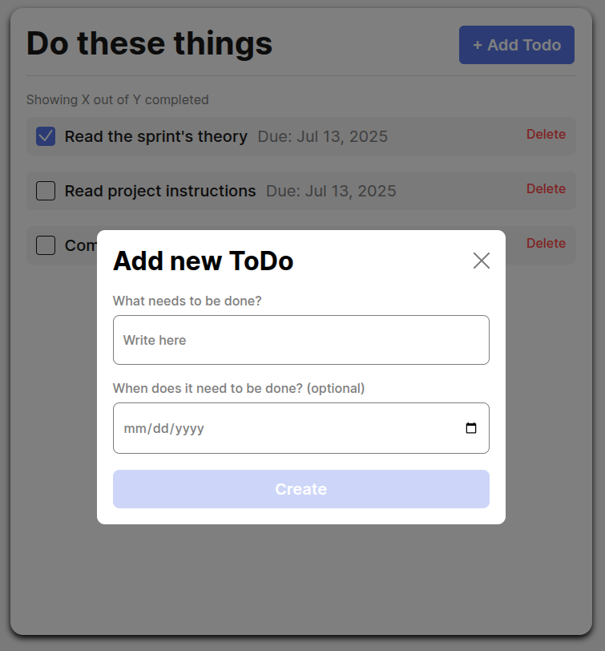

# Simple Todo App

A very simple to-do app that allows for addition and removal of tasks. 

## Functionality

It allows for addition and removal of tasks in a graphical user interface, setting of dates for the tasks, and selection of completion status.

## Technology

HTML, CSS, and JavaScript were all used, utilizing exporting and importing of functions. 

## Deployment

This project is deployed on GitHub Pages:

- [Deployment Link](https://jackclarence.github.io/se_project_todo-app/)
- [Video Link](https://drive.google.com/file/d/14myvD0-4-V5SygUmJZx9sw_DjWesChEn/view?usp=sharing)